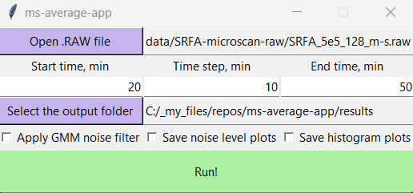

# ms-average-app

This program extracts averaged mass spectra from
a specified ThermoRAW file.
It can only be run on Windows, because it uses COM DLLs.
The program is able to work with files measured using
*segment scan* mass spectral acquisition.

You need the `MSFileReader 3.1 SP4` library installed.
You can find the installation instructions here:
[https://github.com/frallain/pymsfilereader](https://github.com/frallain/pymsfilereader)

The application uses the noise filtering algorithm from here:
[https://gitlab.com/a-potemkin/ms-gmm-noise-filter](https://gitlab.com/a-potemkin/ms-gmm-noise-filter)

## Installation

1. Run `python_lib.bat`, to install the required dependencies.
    The dependencies are listed in `requirements.txt`.

2. Run `app.bat`, to start the application.

## Usage

Program operating modes:

1) The **time step** is not specified.

   а) If you do not fill any time entry,
      averaging will be over the entire chromatogram.

   б) If you specify only the **start time**,
      averaging will be from the **start time** to the
      end of the chromatogram.

   в) If you specify only the **end time**,
      averaging will be from the start of the chromatogram
      to the **end time**.

2) The **time step** is specified.

   The result will be SEVERAL peak lists.
   Each peak list is an averaging of spectra with
   retention times [Current start time, Current finish time).

   Sometimes it is worth specifying start time = 0.

A **new folder** will be created in the output folder with
the same name as the RAW file!
Peak lists and graphics will be saved to this new folder.

The name of the plot PNG file is the same as the name of the peak list
(CSV, TXT files), to which it corresponds (but without the `-dn` part).

